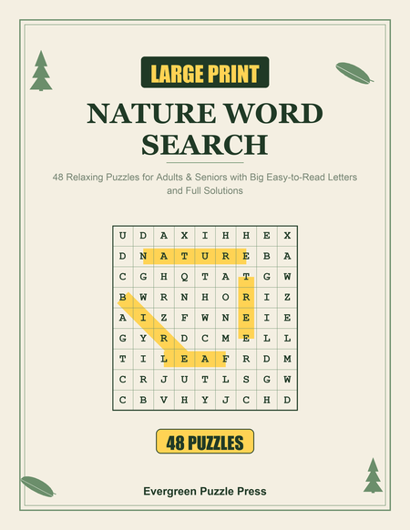
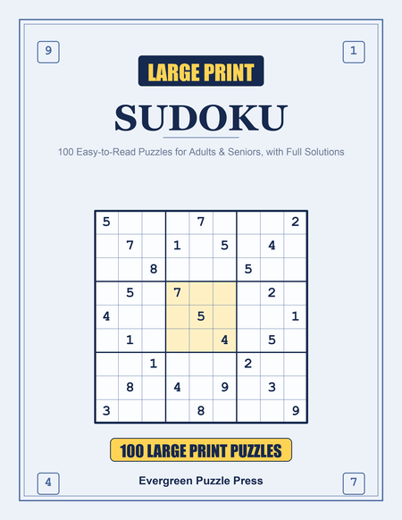

# KDP Puzzle Engine

[](https://github.com/vijaxx/kdp-puzzle-engine/actions/workflows/ci.yml)

[](LICENSE)

Creates polished, print-ready puzzle-book packages for Amazon KDP: Word Search, Sudoku, Cryptograms, and Word Scramble + Trivia. The app builds the interior, cover, full wrap, listing kit, and proof reports together.

The premise: most puzzle-book sellers on KDP build books by hand, one at a time. This generates them, so a new niche is a new JSON file away from a new title rather than a new manual layout job.

## Sample output

<table><tr>
<td><br><sub>wordsearch.py + cover.py</sub></td>
<td><br><sub>Sudoku Book Studio</sub></td>
</tr></table>

## Generators

- **`wordsearch.py`** — takes a theme JSON (a name + word list), lays out a large-print grid guaranteed to place every word, and renders front matter, puzzles, and a full solutions section to an 8.5x11 interior PDF.
- **`sudoku.py`** — standard 9x9 puzzles. Generates valid solved grids via symmetry-preserving transformations of a base grid, then removes cells to hit a target difficulty.
- **`puzzle_book_studio.py`** — builds Sudoku, Cryptogram, and Word Scramble + Trivia packages with automatic content checks, matching local artwork, listing kits, and Proof Gate reports.
- **`cover.py`** / **`wrap_cover.py`** — current cover and full-wrap generation at 300 DPI, palette-matched per theme.

## Automation layer

- **Word Search Creator** — the main, beginner-friendly application for theme selection, cover planning, package creation, and proofing.
- **`preflight.py`** — a compliance check that runs on a built book folder before it's ever uploaded: page-size/count sanity, and the specific formatting issues that have triggered Amazon KDP review flags in practice (e.g. author-field/imprint conflicts, spine text sitting too close to the trim edge on thin books).
- **`publish_tools/`** — small scripts that drive already-published KDP listings: updating a book's search keywords, attaching a book to a series, and the underlying CDP session handling they share.

## Themes

`themes/*.json` are the word lists that drive Word Search creation — one file per niche, series, or edition. The Master Word Bank supplies the Guided Builder and ready-made theme recommendations.

## Stack

Python, ReportLab (PDF generation), Pillow (cover rendering), and local JSON libraries for your themes and artwork.

## Running it

```
pip install -r requirements.txt
python3 wordsearch.py --themes themes/nature.json --out out/nature.pdf
python3 preflight.py out/beach-vacation/                    # compliance check before upload
```

## Windows Word Search Creator

For a no-command-line way to make a word-search book, double-click
`Start Word Search Creator.bat`. Choose **Word Search**, **Sudoku**,
**Cryptograms**, or **Scramble + Trivia** from the clear puzzle-type bar at
the top. The app guides you through the rest and saves each complete package
in its own `out/` folder.

The window runs `wordsearch.py` unchanged, so the command-line instructions
above remain available as the dependable baseline.
